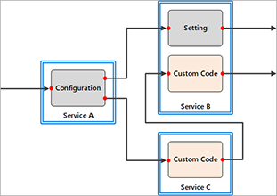
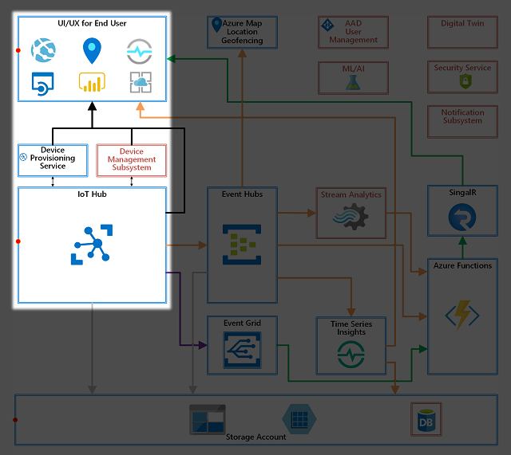
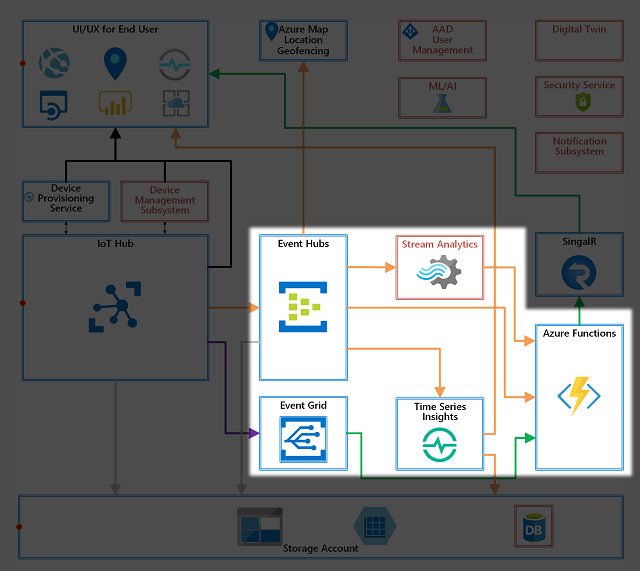
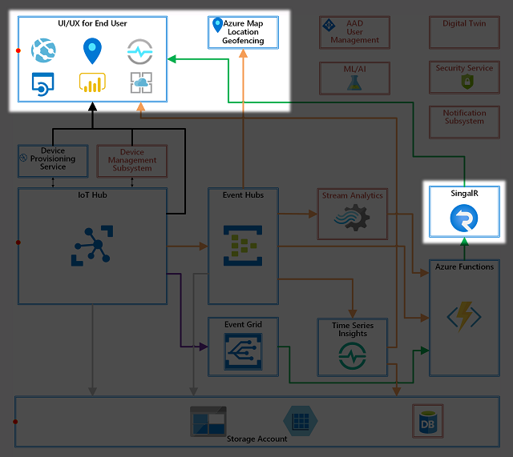

# Open Platform Architecture Overview

Open Platform is consist of multiple Azure services and configurations/settings to :

- Enable Ready to go solution
- Provision devices using Device Provisioning Service
- Connect provisioned IoT Devices to IoT Hub
- Ingest telemetry and events from IoT devices
- Build a data pipeline necessary for basic telemetry and events processing
- Visualize IoT devices, telemetry, device events, and device management events in a web site
- Enable real time visualization using SignalR messaging
- Store and visualize IoT data using Time Series Insights
- Enable location based services using Azure Maps
- Build publish-subscribe model using Event Grid
- Secure the solution by setting security policies and access controls
- Exhibit examples of IoT Data visualization and basic device management

## Technical Goals and Requirements

- Ready to go solution  
    A solution is ready to accept data from devices right after deployment
- Minimize manual operations  
    Automate deployment as much as possible to avoid manual operations
- Pre-configure as much as possible  
    Pre-configure all settings to avoid post deployment configurations

### IoT Application Structure Pattern

IoT solutions are built with various Azure services.  Typically IoT solution architects make following decisions and perform tasks :

- Selection of Azure services to meet requirements  
    Each service provides hosting Environment to perform specific tasks.  
    **Blue boxes** below
- Logical connections between services  
    This is often done by defining and/or configuring inputs and outputs (a.k.a. endpoints).  
    **Red dots and arrows** below
- Settings and configurations on services  
    Typically this is done through settings in each service.  
    **Gray boxes** below.
- Selection of application hosting environment  
    There are many options to run custom applications, and IoT architects need to select right services.  
    **Pink boxes** below.

### Open Platform Design Principle

Considering IoT application structure pattern explained above, Open Platform is designed with 3 classes of components.

- **Ready-to-Run**  
Every IoT solution requires a set of components/features to be functional.  For example, all IoT solutions have devices connected, data to be ingested.  Open Platform is ready to accept data from IoT devices.

- **Pre-Configured**  
Each IoT solution requires some level of customization, however, these IoT solutions share design patterns.  Therefore, Open Platform pre-configures Azure services by creating endpoints and making logical connection.  For example, all IoT solutions receive data from IoT devices, but each IoT solution processes data differently.  

- **Custom Components**  
Components that cannot be pre-configured.  However, Open Platform attempts to make it easy to add these components.  For example, each IoT solution analyzes data based on their goals and requirements, type of data, and format of data.  

## Open Platform Design Overview

Open Platform designed is based on typical IoT use cases.  They are divided into following categories  

- IoT Device Management  
    Device provisioning and device management
- IoT data plumbing  
    Data ingress and egress
- Data Pipeline  
    Typical data inflow and outflow from key Azure services and to data processing components
- Data Storage  
    Storage for various data types
- UI+UX  
    User interface, interaction, and visualization for end users

## IoT Device Management

Typically IoT device management involves :

- Provisioning
- Updates and maintenance
- Device lifecycle management

Open Platform deploys and configures :

- Azure IoT Hub
- Device Provisioning Service (DPS)
- Event Grid

Open Platform provides examples on :

- A web site to interact with IoT Hub to perform device management tasks
- Route device management events from IoT Hub to the web site

More on IoT Device Management : [Open Platform Developer Guide : IoT Device Management](IoT-Device-Management.md)

## Data Plumbing

Data received from devices must go through several steps to be consumable.

1. Accept data into Cloud through IoT Hub
1. Route data to appropriate destinations
1. Make data available for data processing components

These tasks are often referred to as **Data Ingestion**.

Open Platform deploys and configures :

- Azure IoT Hub
- Event Hubs
- Event Grid

Open Platform provides examples on :

- Route device data, telemetry and events, for data processing
- Route device management events

More on Data Plumbing : [Open Platform Developer Guide : Data Ingestion and Data Pipeline](Data-Ingestion-Data-Pipeline.md)

## Data Pipeline

Ingested data must go through processing to be meaningful.  Raw data often does not provide more than a fact, but data processing can add value.  

Examples of data processing are :

- Filtering
- Analyzing
- Taking actions
- Modifying or combining

Open Platform deploys and configures :

- Event Hubs
- Event Grid
- Azure Functions
- Time Series Insights

Open Platform provides examples on :

- Receiving and processing telemetry data in Azure Functions

More on Data Pipeline : [Open Platform Developer Guide : Data Ingestion and Data Pipeline](Data-Ingestion-Data-Pipeline.md)

## Data Storage

Storage options must be carefully selected, as Azure storage services are often tuned for specific use cases.  Typically, selection of storage type depends on frequency of access.

- Hot storage  
    Data is frequently accessed on fast storage
- Warm storage  
    Data is accessed less frequently than that on Hot Storage
- Cold storage  
    Data is rarely accessed on the slow storage

Open Platform deploys and configures :

- Storage accounts for various Azure services
- Time Series Insights
- Endpoints in various services

Open Platform provides examples on :

- A web site that can visualize IoT telemetry data stored in Time Series Insights

More on Data Storage : [Open Platform Developer Guide : Data Storage](Data-Storage.md)

## UX + UI

User experience (UX) is often provided through User Interface (UI).  For example a web site to host a dashboard, mobile app to receive notification, or a desktop application to input data.  
UI components are highly dependent on UX the solution wants to provide, use cases for the solution, and type of users.  Therefore, Open Platform exhibits some of UIs as examples through deploying and configuring a few Azure services.  

Open Platform deploys and configures :

- App Service
- Web App
- Azure Functions
- Azure Maps
- Time Series Insights
- SignalR

Open Platform provides examples on :

- A web site to :  

  - Visualizes telemetry
  - Receive real-time notification
  - Display map

More on UX and UI : [Open Platform Developer Guide : User Experience and User Interface](UX+UI.md)

[Project 15 from Microsoft - Open Platform](../README.md)
